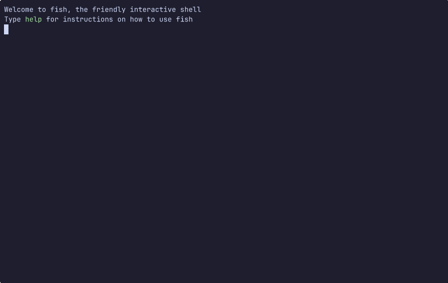

# duat-sneak  [](https://crates.io/crates/duat-sneak) [](https://docs.rs/duat-sneak) [](https://github.com/AhoyISki/duat)



A `duat` [`Mode`][__link0] for searching for character sequences

This is a plugin inspired by [`vim-sneak`][__link1], which is a kind of
extension to the regular `f`/`t` key bindings in vim. This one is
similar to it, but implemented for Duat instead

## Installation

Just like other plugins, this one can be installed by adding the
following to your [`Cargo.toml`’s `dependencies` section][__link2]:

```toml
[dependencies.sneak]
version = "*"
package = "duat-sneak"
```

## Usage

In order to make use of it, just add the following to your `setup`
function:

```rust
use sneak::*;
map::<User>("s", Sneak::new());
```

In this mode, these are the available key sequences:

* `{char0}{char1}`: Highlight any instance of the string
  `{char0}{char1}` on screen. If there is only one instance, it
  will be selected immediately, returning to the [default mode][__link3].
  If there are multiple instances, one entry will be selected, and
  typing does the following:
  
  * `n` for the next entry
  * `N` for the previous entry if [`mode::alt_is_reverse()`][__link4] is
    `false`
  * `<A-n>` for the previous entry if [`mode::alt_is_reverse()`][__link5]
    is `true`
  * Any other key will select and return to the [default mode][__link6]
* Any other key will pick the last `{char0}{char1}` sequence and
  use that. If there was no previous sequence, just returns to the
  [default mode][__link7].

## More Options

```rust
fn setup() {
    map::<User>("s", Sneak::new().select_keys(',', ';').with_len(3));
}
```

Instead of switching with the regular keys, `;` selects the
previous entry and `,` selects the next. Additionally, this will
select three characters instead of just two.

## Labels

If there are too many matches, switching to a far away match could
be tedious, so you can do the following instead:

```rust
fn setup() {
    map::<User>("s", Sneak::new().min_for_labels(8));
}
```

Now, if there are 8 or more matches, instead of switching to them
via `n` and `N`, labels with one character will show up on each
match. If you type the character in a label, all other labels will
be filtered out, until there is only one label left, at which
point it will be selected and you’ll return to the [default mode][__link8].


 [__cargo_doc2readme_dependencies_info]: ggGkYW0BYXSEG7OnKS_PkemFG56IpJ_QmFWVGx-ENAHaG7xgG84zvdQl8TPsYXKEG_AdYqFW4g15G5K3IbIxj4M2G2MegS_OKW5cG7oVnW-Xu69YYWSCgmlkdWF0X2NvcmVlMC41LjGCZG1vZGX2
 [__link0]: https://docs.rs/duat_core/0.5.1/duat_core/?search=mode::Mode
 [__link1]: https://github.com/justinmk/vim-sneak
 [__link2]: https://doc.rust-lang.org/cargo/reference/specifying-dependencies.html
 [__link3]: https://docs.rs/mode/latest/mode/?search=reset
 [__link4]: `mode::alt_is_reverse()`
 [__link5]: `mode::alt_is_reverse()`
 [__link6]: https://docs.rs/mode/latest/mode/?search=reset
 [__link7]: https://docs.rs/mode/latest/mode/?search=reset
 [__link8]: https://docs.rs/mode/latest/mode/?search=reset
